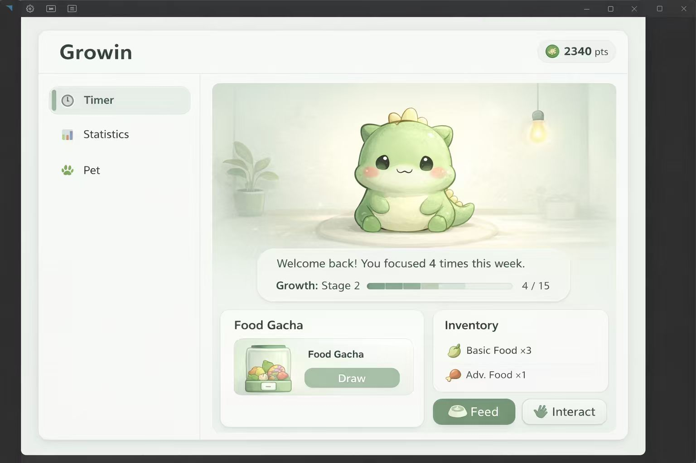

📝 Capstone Project — 本周任务计划  
📅 周期：2026/01/19 – 2026/01/24

---

## 🎯 本周目标（Goal）

正式推进 **Pet 系统**，实现：

➡️ **每次 Focus Session 成功完成 → 获得代币（Token，右上角 pts） → 抽取宠物食物 → 喂养宠物 → 宠物成长反馈**

---

## 🟦 Backend — 本周计划

### 1️⃣ Token System（Session → Token）
**目标**：为 P1 提供基础经济系统

- 在 Focus Session **成功结束（Success）** 时：
  - 自动生成一定数量的 Token
  - 与用户 Profile 关联并本地持久化
- 提供 API：
  - `GET /api/tokens` —— 获取当前 Token 数量
  - `POST /api/tokens/add`（内部调用）—— Session 成功后增加 Token

📌 结果：
- UI 右上角 `pts` 由真实数据驱动
- Token 成为 购买宠物食物的唯一代币

### 3️⃣ Food Gacha Draw Logic
**目标**：让 “Draw” 按钮形成真实逻辑闭环

- 扣除指定 Token 数量
- 从 Food Pool 中随机抽取食物
- 将结果写入 Inventory
- 提供 API：
  - `POST /api/gacha/food/draw`
  - `GET /api/inventory`

---

## 🟦 Frontend — 本周计划

### 1️⃣ Token 显示与联动
- 将右上角 Token 显示改为真实后端数据
- Session 成功完成后：
  - 即时更新 Token 数量
  - 提供轻量视觉反馈（数值变化即可）

---

### 2️⃣ Food Gacha UI（对照 Pet 页面设计）
- Food Gacha 区域：
  - 点击 **Draw** 调用后端 Gacha API
- 抽取结果：
  - 自动进入 Inventory
  - 动画与特效允许使用 placeholder

---

### 3️⃣ Inventory & Feed 行为
- 点击 **Feed**：
  - 消耗 1 个食物
  - 触发宠物成长数值变化

---

### 4️⃣ Pet Growth（最小成长模型）
**目标**：建立数值 + UI 的可感知反馈

- Pet 基础状态：
  - `growthStage`
  - `currentExp`
- Feed 后：
  - 增加经验值
  - 更新进度条显示  
    `Growth: Stage X (current / total)`
- 本周不做形态切换，仅数值与文案更新

---

## 🟦 本周完成后的 Demo 状态

✅ 完成一次 Focus Session  
⬇  
✅ Token 数量增加  
⬇  
✅ 使用 Token 抽取或兑换 Food 
⬇  
✅ Food 进入 Inventory  
⬇  
✅ Feed 宠物  
⬇  
✅ Pet Growth 进度发生变化（UI 可见）

➡️ **形成完整的 P1 Gamification 闭环**

---
